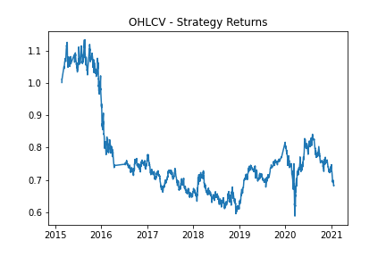
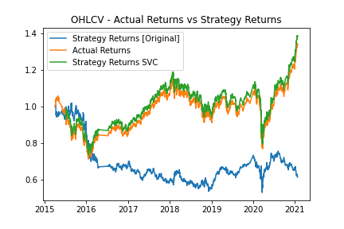
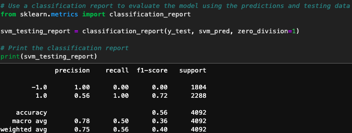
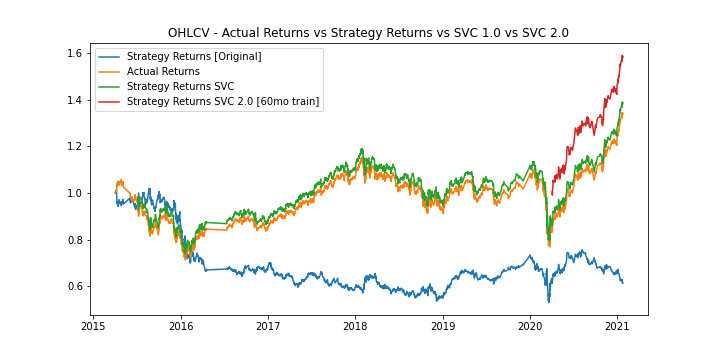

# Module-14-Challenge (Report)

## Algorithmic Trading Bot

---

 

### <u>Overview of the Analysis</u>

 

### <b>Purpose:</b>

The purpose of this software was to develop an algorithmic trading system using machine learning (ML) to automate trading decisions. Input parameters are adjusted to optimize the developed algorithm. Additionally, a secondary machine learning model was developed & introduced to use in comparison to the baseline model.

### <b>Process & Variables:</b>

 

#### 1.) <u>Establishment of a Baseline Model:</u>

 
    i.) The OHLCV dataset - representing the open, high, low, close & volume dataset for Morgan Stanley Capital International (MSCI) based emerging markets exchange traded fund (ETF issued by iShares [Blackrock]) - was imported into a Pandas DataFrame. Trading signals were established by using short & long-window simple moving average (SMA) values. The data was then manually split into training & testing datasets. 
 
 
    ii.) Instantiate Support Vector Machine (SVM) (SVC) Classifier Model - Using the SciKit Learn (sklearn) support vector machine (SVM) learning method the training data was fit to make predictions based on the testing data. The prediction data was then reviewed & a classification report was generated for the SVC model predictions. i.) The OHLCV dataset was imported into a Pandas DataFrame. Trading signals were established by using short & long-window simple moving average (SMA) values. Note: In the original run model the short window = 4 and the long window = 100 period intervals. The data was then manually split into training & testing datasets.
 
 
    iii.) Predictions Dataframe & Cumulative Return Plot - The above resulting data series were then compiled into a Dataframe that contains both the 'Predicted', 'Actual Returns', and 'Strategy Returns' in their own columns as well. A cumulative return plot was then generated that illustrates the actual returns vs the strategy returns. A .png image was saved and included in this report as a baseline to compare the affects of algorithm tuning later on.
 
 

#### 2.) <u>Tuning the Baseline Trading Algorithm: </u>

  
    i.) In this section the model's input features were modified in an attempt to find the best trading outcomes for the program. This is accomplished by comparing the cumulative  product returns of each of the modified 'Strategy Returns', depending upon the ML model & its parameter adjustments. This was accomplished by first adjusting the size of the training dataset window (slicing the data into different period ratios between the training set size/time and the testing set size/time). 
 
 
    ii.) Next, the trading algorithm was altered by modifying the SMA input features. This was accomplished by re-setting the short/long-window instances from short = 4 & long = 100 to other test instance values. Note: In the case of this program the short was reset to short = 3 and long = 50. 
 
 
    iii.) Parameters were then decided upon that optimized the trading algorithms returns and documented as a PNG image file.

 

#### 3.) <u>Evaluating a New Machine Learning Classifier: </u>

 
    i.) Within this section of the report/program the original parameters were utilized but fed into a second and fundamentally different machine learning model. This was accomplished via the following steps: 
 

&emsp;&emsp;&emsp; a.) A new classifier was imported (in this case 'LogisticRegression' from 'sklearn.linear_model').
 
&emsp;&emsp;&emsp; b.) Using the original training data as the baseline model, another model was fit using this 'LogisticRegression' classifier.
 
&emsp;&emsp;&emsp; c.) This new model was backtested to evaluate its performance, relative to the original SVM (SVC) classifier model.
 
&emsp;&emsp;&emsp; d.) A PNG image of the cumulative actual returns vs new strategy returns for the updated trading algorithm was generated and results/conclusions derived as such.

 

### <u>Results</u>

- <u>Algorithmic Trading Bot:</u>

  - <u>Baseline Model:</u>
    

    
    

  - <u>Strategy Returns Using Support Vector Machine (SVC) Modelling:</u>

    The figure below illustrates the cumulative returns comparison of the 'Actual Returns' vs 'Strategy Returns' vs 'Strategy Support Vector Machine (SVC) Returns'.
    It can be noted that by combining the X-features out of the SMA-short/long rolling average data and incorporating the original buy/sell signal data generated from the +/-1 actual daily percent change returns into a SVC Model, there is a slight cumulative returns advantage against the 'Actual Returns'. And there is a significant advantage over the baseline 'Strategy Returns [Original]' cumulative returns.

  

  
  

  - <u>Classification Report of Support Vector Machine (SVC) Model #1:</u>

    Below is the summary classification report
     

    |            | precision | recall | f1-score | support |
    | ---------- | --------- | ------ | -------- | ------- |
    | -1.0       | 1.00      | 0.00   | 0.00     | 1804    |
    | 1.0        | 0.56      | 1.00   | 0.72     | 2288    |
    | accuracy   |           |        | 0.56     | 4092    |
    | macro avg  | 0.78      | 0.50   | 0.36     | 4092    |
    | weight avg | 0.75      | 0.56   | 0.40     | 4092    |

   

  - <u> SVC Report Summary (From Data Above) </u>
    

    
    

   
   

  - <u>Strategy Returns Using Support Vector Machine (SVC) Modelling #2 - Training Period Adjusted (60 Months Optimization):</u>

    The figure below illustrates the cumulative returns comparison of the 'Actual Returns' vs 'Strategy Returns' vs 'Strategy Support Vector Machine (SVC) Returns'.
    It can be noted that by combining the X-features out of the SMA-short/long rolling average data and incorporating the original buy/sell signal data generated from the +/-1 actual daily percent change returns into a SVC Model, there is a slight cumulative returns advantage against the 'Actual Returns'. And there is a significant advantage over the baseline 'Strategy Returns [Original]' cumulative returns.

  

  
  

  - <u>Classification Report of Support Vector Machine (SVC) Modelling #2 - Training Period Adjusted (60 Months Optimization):</u>

    Below is the summary classification report
     

    |            | precision | recall | f1-score | support |
    | ---------- | --------- | ------ | -------- | ------- |
    | -1.0       | 1.00      | 0.00   | 0.00     | 155     |
    | 1.0        | 0.62      | 1.00   | 0.76     | 250     |
    | accuracy   |           |        | 0.62     | 405     |
    | macro avg  | 0.81      | 0.50   | 0.38     | 405     |
    | weight avg | 0.76      | 0.62   | 0.47     | 405     |

   

  - <u> Support Vector Machine (SVC) Modelling #2 - Training Period Adjusted (60 Months Optimization) Report Summary (From Data Above) </u>
    

    
    

 
 

### <u>Summary</u>

Therefore, it was determined .
